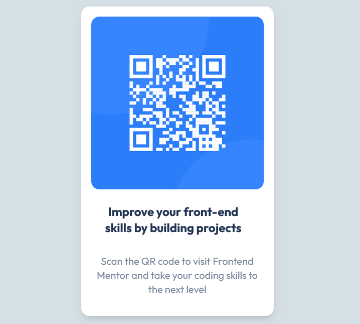

# Frontend Mentor - QR code component solution

This is a solution to the [QR code component challenge on Frontend Mentor](https://www.frontendmentor.io/challenges/qr-code-component-iux_sIO_H). Frontend Mentor challenges help you improve your coding skills by building realistic projects. 

## Table of contents

- [Overview](#overview)
  - [Screenshot](#screenshot)
  - [Links](#links)
  - [Built with](#built-with)
  - [What I learned](#what-i-learned)
  - [Useful resources](#useful-resources)
- [Author](#author)

**Note: Delete this note and update the table of contents based on what sections you keep.**

## Overview

### Screenshot

### Links

- Live Site URL: [QR CODE](https://qrcodefrontenddesign.netlify.app/)

### Built with

- React
- Tailwind CSS
- CSS
- [React](https://reactjs.org/) - JS library

## Author

- Frontend Mentor - [@Therealadetunji](https://www.frontendmentor.io/profile/Therealadetunji)